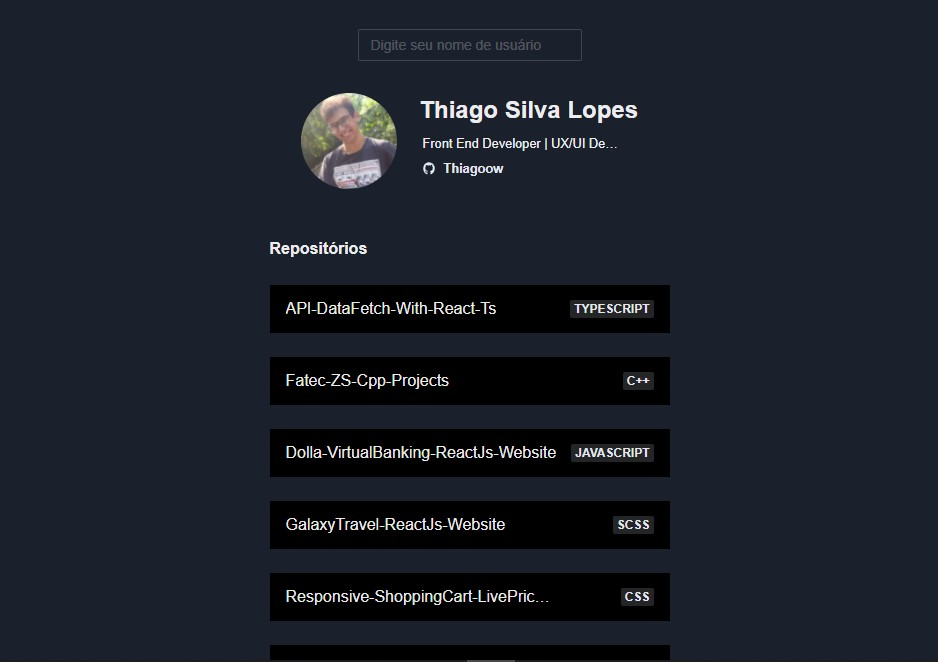

<!---->

# API Data Fetch - With React + TypeScript

Esse projeto foi feito por: <strong>Thiago Silva Lopes</strong>, em 03/2022, 
tendo como base o <a href="https://www.youtube.com/watch?v=vH_nFQIXy1k" target="_blank">tutorial</a>
do canal do Youtube: <a href="https://www.youtube.com/channel/UCX9otLxCQzLN0CrW6CKQCHg" target="_blank">
dogcode</a>

## Demo: https://demo-react-query.netlify.app/
